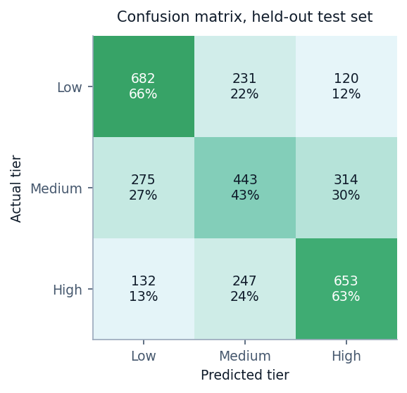
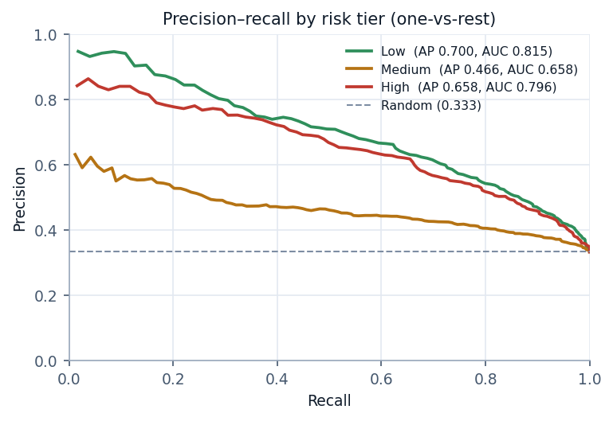
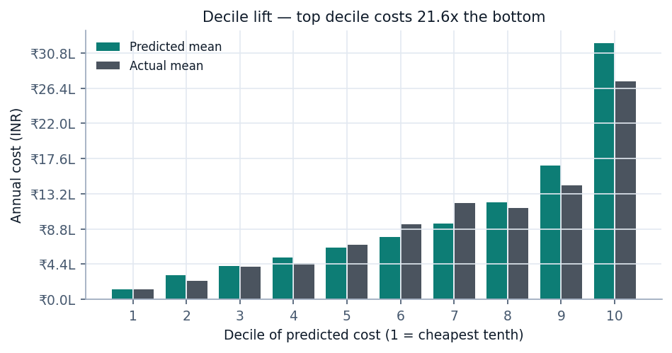
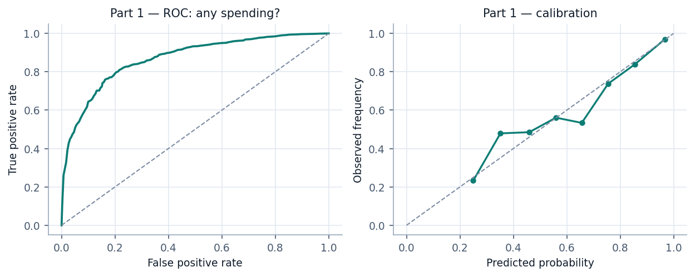
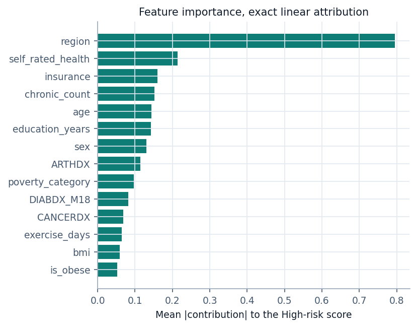
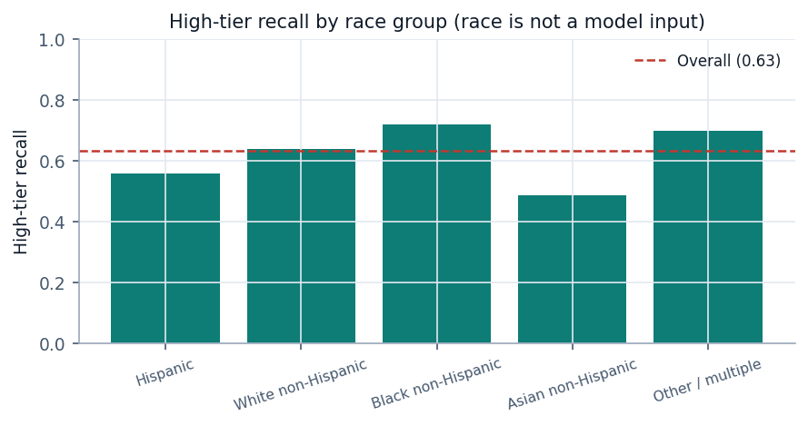

# 4 · Results and validation

> Generated automatically by `ml/make_report.py` from `ml/artifacts/metrics.json`.
> Training run: **2026-09-20 20:31:17**. Do not edit by hand — re-run the pipeline.

Every figure on this page comes from **3,097 held-out people** who took no
part in training, in feature engineering, or in choosing a model.

> **A note on currency.** MEPS records **US** healthcare spending in US dollars,
> and the models are trained and evaluated in dollars. Every money figure below is
> converted for display at **1 USD = 88 INR**, set in `ml/config.py`.
>
> Converting a US cost into rupees does **not** turn it into an Indian cost. The
> same treatment costs several times more in the US than in India, so read these
> as *"what this care costs in the American system, shown in rupees"* — a familiar
> unit, not a prediction of an Indian hospital bill. Re-training on Indian claims
> data would be a different project, and the pipeline here would transfer to it.

---

## 4.1 How validation was set up

| Choice | Value | Why |
|---|---|---|
| Test split | 20% (3,097 people) | Touched exactly once, at the very end |
| Cross-validation | 5-fold stratified | Used for all model selection, on the training split only |
| Random seed | 42 | Fixed everywhere, so the run reproduces |
| Stratification | By risk tier | Keeps tier balance identical across splits |
| Tier cut points | Learned on train only | So the test set does not even influence the labels |
| Uncertainty | 400-sample bootstrap | Reported as 95% intervals on headline metrics |

**Leakage guard.** Total expenditure defines the tier label, so it can never be an
input. The training script asserts this and aborts if the target or the survey
weight ever appears in the feature matrix.

---

## 4.2 Task B — risk stratification

Three equal-sized tiers, so a random guesser scores about 0.333 macro-F1.

- **Low** — under ₹84,979 a year
- **Medium** — ₹84,979 to ₹563,053
- **High** — over ₹563,053

### Model comparison

| Model | CV macro-F1 | Test macro-F1 | Accuracy | Balanced acc. | High recall | High precision | Macro ROC-AUC |
|---|---|---|---|---|---|---|---|
| Stratified baseline | 0.3233 ± 0.0089 | 0.341 | 0.341 | 0.341 | 0.324 | 0.322 | 0.505 |
| Logistic Regression **(deployed)** | 0.5590 ± 0.0092 | 0.571 | 0.574 | 0.574 | 0.633 | 0.601 | 0.756 |
| Random Forest | 0.5506 ± 0.0037 | 0.567 | 0.572 | 0.572 | 0.641 | 0.601 | 0.756 |
| XGBoost | 0.5577 ± 0.0080 | 0.571 | 0.574 | 0.574 | 0.626 | 0.603 | 0.757 |

The three real models sit within about 0.01 macro-F1 of one another, comfortably
inside the fold-to-fold spread. When the scores tie, the tiebreak has to be
something other than the third decimal: the logistic regression is deployed
because it serialises to 14 KB, runs in the browser, and produces **exact**
per-person attributions instead of approximate ones.

**95% bootstrap interval on the deployed macro-F1:**
[0.555, 0.587]

### Precision and recall per tier

| Tier | Precision | Recall | F1 | Support |
|---|---|---|---|---|
| Low | 0.626 | 0.660 | 0.643 | 1033 |
| Medium | 0.481 | 0.429 | 0.454 | 1032 |
| High | 0.601 | 0.633 | 0.616 | 1032 |

*Precision* — when the model says this tier, how often it is right.
*Recall* — of everyone truly in this tier, how many it found.

The **Medium** tier is the weakest, and that is structural rather than a tuning
failure: it is bounded by two arbitrary cut points with genuinely similar people
on either side. A person spending ₹80,579 and one spending
₹89,379 are indistinguishable in every way that matters,
yet the labels put them in different classes. Low and High are separated by real
differences, and the model finds them.

### Confusion matrix

|  | Predicted Low | Predicted Medium | Predicted High |
|---|---|---|---|
| **Actually Low** | 682 | 231 | 120 |
| **Actually Medium** | 275 | 443 | 314 |
| **Actually High** | 132 | 247 | 653 |

The two errors are not equally expensive. A Low person called High is a customer
who walks to a competitor. A High person called Low is an unpriced loss on the
books. The second is the one to minimise.

### Precision–recall curves

| Tier | Average precision | ROC-AUC | Prevalence |
|---|---|---|---|
| Low | 0.700 | 0.815 | 0.334 |
| Medium | 0.466 | 0.658 | 0.333 |
| High | 0.658 | 0.796 | 0.333 |

### Choosing the High-tier threshold

Missing a high-cost person is the costliest error, so the decision threshold is a
business choice rather than a default. Lowering it below 0.5 buys recall with
precision:

| Threshold on P(High) | Recall | Precision | Share of people flagged |
|---|---|---|---|
| 0.15 | 0.941 | 0.417 | 75.1% |
| 0.2 | 0.903 | 0.452 | 66.6% |
| 0.25 | 0.855 | 0.488 | 58.3% |
| 0.3 | 0.786 | 0.533 | 49.1% |
| 0.35 | 0.715 | 0.563 | 42.3% |
| 0.4 | 0.661 | 0.606 | 36.4% |
| 0.45 | 0.579 | 0.641 | 30.1% |
| 0.5 | 0.503 | 0.665 | 25.2% |
| 0.55 | 0.442 | 0.699 | 21.1% |
| 0.6 | 0.374 | 0.735 | 17.0% |

---

## 4.3 Task A — expected annual cost

| Model | MAE | RMSE | R² | Median error | Mean predicted |
|---|---|---|---|---|---|
| **Tweedie GLM (deployed, power=1.3)** | ₹944,761 | ₹2,275,606 | 0.0921 | ₹498,040 | ₹981,085 |
| XGBoost, Tweedie objective | ₹908,316 | ₹2,281,892 | 0.0870 | ₹438,918 | ₹899,210 |
| Two-part log, mean-calibrated | ₹902,616 | ₹2,325,886 | 0.0515 | ₹360,126 | ₹890,994 |
| OLS on raw dollars | ₹986,306 | ₹2,275,698 | 0.0920 | ₹605,680 | ₹969,453 |
| Predict the training mean | ₹1,101,735 | ₹2,388,230 | -0.0000 | ₹837,329 | ₹946,801 |
| Single-stage log + Duan smearing | ₹5,122,087 | ₹9,105,340 | -13.5363 | ₹2,287,690 | ₹5,713,944 |

Actual mean cost in the test set: **₹933,010**.
95% bootstrap interval on the deployed MAE:
[₹874,595, ₹1,012,497].

### Reading these numbers honestly

R² of about 0.09 is low, and no amount of tuning fixes it.
Individual annual medical spending is close to unpredictable from demographics,
because most of the variance comes from *events* — an accident, a new diagnosis —
that no survey question can anticipate. This is a well-known ceiling in health
economics, not a defect in this pipeline. The model earns its place by ranking
groups, which is what pricing actually needs.

### The negative result worth reporting

The brief prescribes training on log(charges) and back-transforming with Duan's
smearing estimator. That was implemented, and it **failed**: MAE
₹5,122,087, R²
-13.54 — far worse than guessing the average for
everybody.

The cause is that smearing multiplies by the mean of exp(residual). With residuals
this long-tailed, that mean is dominated by a handful of enormous ones: the
out-of-fold factor came out at **2.96**, so every prediction
was inflated roughly threefold.

Two fixes were tried:

1. **Mean-preserving calibration.** One scalar, fitted out-of-fold, so total
   predicted spend equals total observed spend. Factor: 2.139.
   This rescues the two-part model to MAE ₹902,616.
2. **Stop back-transforming at all.** A Tweedie distribution with power between 1
   and 2 is a compound Poisson–Gamma: an atom of probability at exactly zero plus
   a continuous right-skewed part. That is a literal description of annual medical
   spending, which is why general insurers price on it. With a log link it models
   expected dollars directly. The power was chosen by cross-validated MAE:
   **1.3**.

The second fix won and is deployed.

### Decile lift — the metric that matters for pricing

| Decile | Predicted mean | Actual mean | People |
|---|---|---|---|
| 1 | ₹121,630 | ₹126,086 | 310 |
| 2 | ₹297,784 | ₹235,007 | 310 |
| 3 | ₹418,762 | ₹404,530 | 310 |
| 4 | ₹526,822 | ₹456,154 | 310 |
| 5 | ₹643,140 | ₹677,907 | 310 |
| 6 | ₹776,847 | ₹941,387 | 310 |
| 7 | ₹946,504 | ₹1,199,669 | 310 |
| 8 | ₹1,216,768 | ₹1,141,426 | 309 |
| 9 | ₹1,670,710 | ₹1,428,165 | 309 |
| 10 | ₹3,202,037 | ₹2,727,822 | 309 |

Sort everyone by predicted cost and cut into ten equal groups: the top tenth really
did spend **21.6×** what the bottom tenth spent. A model
with R² of 0.09 that separates groups this cleanly is useful
for pricing a pool, even though it cannot tell any individual what they will spend.

---

## 4.4 Two-part model, Part 1 — does this person spend anything?

86.7% of held-out adults had some spending during the year.

| Model | CV ROC-AUC | Test ROC-AUC | PR-AUC | Accuracy | F1 | Brier |
|---|---|---|---|---|---|---|
| Majority baseline | 0.5000 ± 0.0000 | 0.500 | 0.867 | 0.867 | 0.929 | 0.133 |
| Logistic Regression **(deployed)** | 0.8631 ± 0.0040 | 0.868 | 0.975 | 0.882 | 0.935 | 0.084 |
| Random Forest | 0.8679 ± 0.0046 | 0.866 | 0.976 | 0.883 | 0.936 | 0.084 |
| XGBoost | 0.8666 ± 0.0034 | 0.871 | 0.976 | 0.884 | 0.936 | 0.083 |

The **Brier score** is included because the two-part model multiplies by this
probability. A classifier that ranks well but is badly calibrated would still
corrupt the dollar figure downstream, and ROC-AUC alone would not reveal it.

### Part 2 — how much, given that they spend anything?

Fitted on 10,725 training spenders, evaluated on
2,686 test spenders, in log space.

| Model | CV R² (log) | Test R² (log) | MAE (log) | RMSE (log) |
|---|---|---|---|---|
| Mean baseline | -0.0025 ± 0.0027 | -0.000 | 1.390 | 1.731 |
| Linear Regression | 0.2494 ± 0.0210 | 0.254 | 1.164 | 1.495 |
| Ridge Regression **(deployed)** | 0.2495 ± 0.0210 | 0.254 | 1.164 | 1.495 |
| Random Forest | 0.2429 ± 0.0288 | 0.245 | 1.175 | 1.504 |
| XGBoost | 0.2518 ± 0.0293 | 0.263 | 1.163 | 1.486 |

Conditional on spending anything at all, the model explains about
26% of the variation in log-spend —
much better than the dollar-scale R², because the log scale removes the tail that
dominates everything else.

---

## 4.5 Explainability

Exact linear SHAP on the deployed logistic model (coef_j * standardised x_j), cross-checked against TreeSHAP on the XGBoost challenger and permutation importance.

| Source feature | Mean |contribution| | TreeSHAP cross-check |
|---|---|---|
| region | 0.7952 | 0.1082 |
| self_rated_health | 0.2133 | 0.1230 |
| insurance | 0.1594 | 0.1291 |
| chronic_count | 0.1512 | 0.2831 |
| age | 0.1432 | 0.1416 |
| education_years | 0.1425 | 0.1490 |
| sex | 0.1306 | 0.0950 |
| ARTHDX | 0.1140 | 0.0635 |
| poverty_category | 0.0968 | 0.0865 |
| DIABDX_M18 | 0.0824 | 0.0432 |
| CANCERDX | 0.0678 | 0.0378 |
| exercise_days | 0.0645 | 0.0535 |
| bmi | 0.0583 | 0.0602 |
| is_obese | 0.0520 | 0.0029 |

**Why these attributions are exact.** SHAP for a tree ensemble is an estimate. For
a linear model it is closed-form: the contribution of feature *j* is its
coefficient times how far that person's standardised answer sits from a fixed
reference person, and the contributions sum to the person's score minus the
reference score with nothing left over. The training run checks that identity
numerically on every run — largest discrepancy across the whole test set:
**2.22e-15**, which is floating-point rounding.

**Why a reference person.** The one-hot dummies for region and the other
categorical answers are collinear, so their raw coefficients are identified only
up to a shared constant, which L2 regularisation splits arbitrarily. Differencing
against a fixed reference cancels that constant exactly — and it makes the
explanation legible: *compared with a typical adult, here is what your answers
did.*

**Agreement with TreeSHAP:** Spearman rank correlation
0.701 between the exact linear attribution and
TreeSHAP on the XGBoost challenger. The two model families broadly read the same
signal, which is reassurance that the deployed model is not leaning on an artefact.

---

## 4.6 Fairness audit

Race is **not** an input to any model here. That is necessary but not sufficient —
a model can still perform unevenly by leaning on correlated features — so the
finished model is measured separately within each group.

### Race and ethnicity

| Group | People | High-tier recall | Macro-F1 | Mean cost error | Actual mean cost | Predicted mean cost |
|---|---|---|---|---|---|---|
| Hispanic | 602 | 0.559 | 0.561 | ₹599,367 | ₹510,884 | ₹664,401 |
| White non-Hispanic | 1843 | 0.638 | 0.561 | ₹1,083,239 | ₹1,144,980 | ₹1,110,203 |
| Black non-Hispanic | 382 | 0.718 | 0.559 | ₹976,339 | ₹884,746 | ₹924,685 |
| Asian non-Hispanic | 178 | 0.486 | 0.441 | ₹674,822 | ₹426,983 | ₹795,632 |
| Other / multiple | 92 | 0.700 | 0.535 | ₹821,916 | ₹628,300 | ₹1,059,732 |

### Sex

| Group | People | High-tier recall | Macro-F1 | Mean cost error | Actual mean cost | Predicted mean cost |
|---|---|---|---|---|---|---|
| Male | 1473 | 0.604 | 0.572 | ₹842,918 | ₹772,347 | ₹915,755 |
| Female | 1624 | 0.654 | 0.561 | ₹1,037,134 | ₹1,078,733 | ₹1,040,342 |

### Income band

| Group | People | High-tier recall | Macro-F1 | Mean cost error | Actual mean cost | Predicted mean cost |
|---|---|---|---|---|---|---|
| Poor / negative | 418 | 0.683 | 0.539 | ₹1,045,307 | ₹952,794 | ₹1,041,215 |
| Near poor | 119 | 0.694 | 0.539 | ₹894,262 | ₹1,004,032 | ₹1,021,805 |
| Low income | 354 | 0.718 | 0.570 | ₹962,601 | ₹983,920 | ₹995,352 |
| Middle income | 829 | 0.667 | 0.571 | ₹876,851 | ₹865,272 | ₹917,929 |
| High income | 1377 | 0.575 | 0.553 | ₹954,901 | ₹948,558 | ₹993,669 |

### What the audit found

High-tier recall ranges from **0.49** to **0.72** across race
groups. The model finds high-cost people in some groups noticeably more reliably
than in others. Some groups have only a couple of hundred people in the test set,
so their individual figures are unstable — but the spread is wide enough that it
should not be waved away.

Dollar errors differ by group too, largely because mean spending itself differs: a
group that spends more gives the model more room to be wrong. Before anything like
this went near a real pricing decision, these gaps would need to be the subject of
the conversation rather than a footnote to it.

---

## 4.7 Summary

| Question | Answer |
|---|---|
| Can we predict an individual's annual cost? | Only weakly. R² 0.09, typical miss ₹944,761. |
| Can we rank people by cost? | Yes. The top predicted decile really costs 21.6× the bottom. |
| Can we sort people into risk tiers? | Reasonably. Macro-F1 0.571 against 0.333 for chance. |
| Do we catch the high-cost people? | 63% of them, at 60% precision — tunable via the threshold table above. |
| Can we explain a decision? | Exactly, to 2e-15 of floating-point error. |
| Does it work equally well for everyone? | No. See the fairness audit above. |
